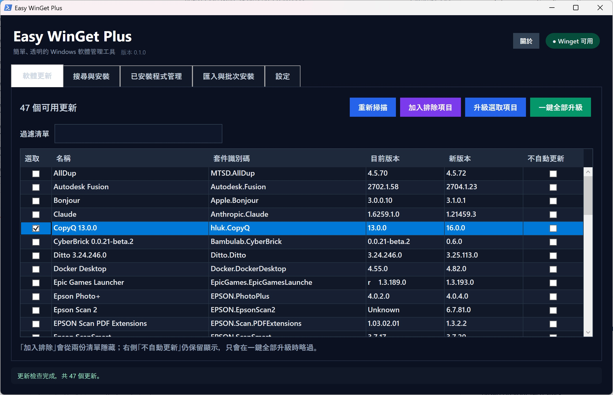
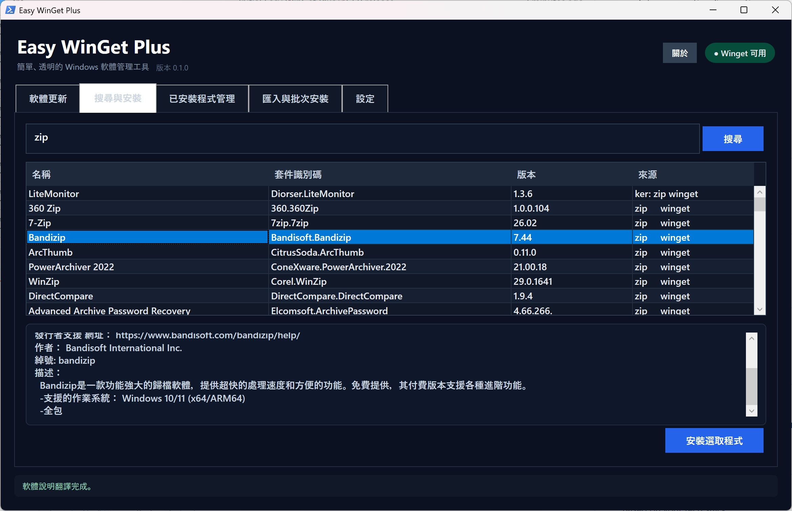
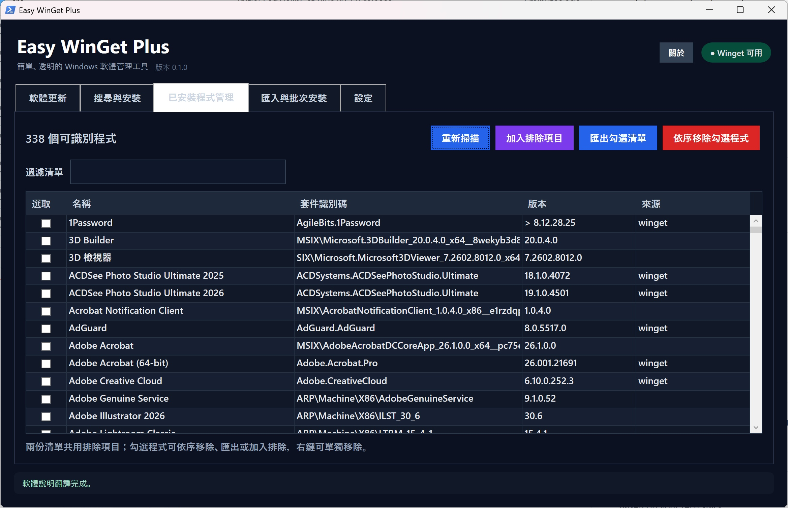
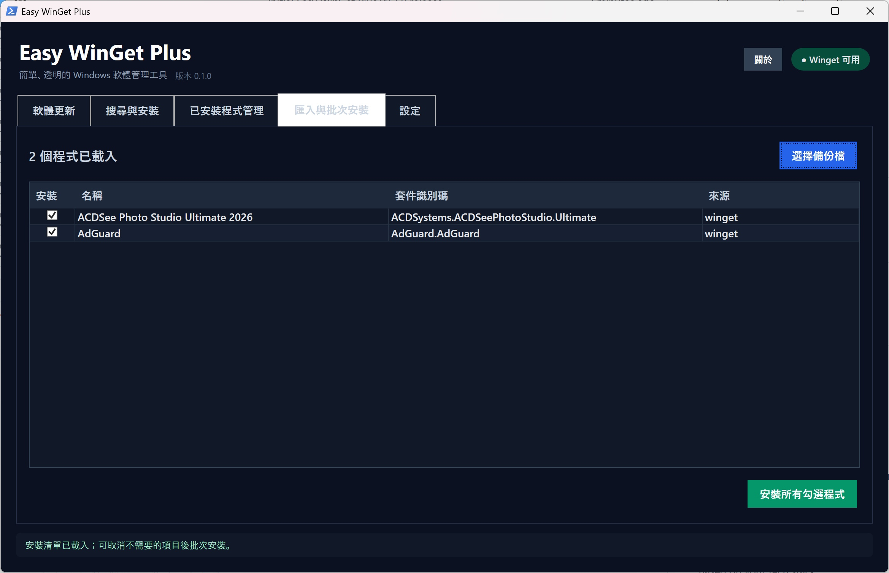
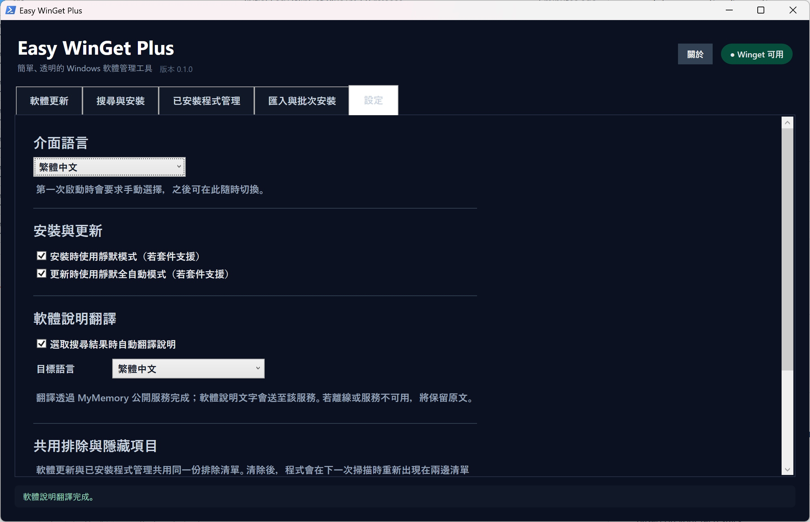

# Easy WinGet Plus

[English](README.en.md) | **繁體中文**

Easy WinGet Plus 是一套可攜式 Windows 圖形化軟體管理工具，使用系統內建的 Windows Package Manager（Winget）完成程式搜尋、安裝、更新、移除與安裝清單備份。

**完全免費、無廣告，並以開放原始碼方式提供。**

目前版本：**0.1.6**

## 0.1.6 更新簡述

- 將「選取」及「不自動更新」欄位標題調整為水平置中，與欄內核取方塊對齊
- 所有清單的名稱、套件識別碼、版本及來源欄位改為唯讀，避免雙擊後出現沒有實際作用的文字編輯狀態
- 保留選取、不自動更新及匯入安裝等核取方塊的正常操作
- 軟體更新與已安裝程式管理清單的右鍵選單末端新增「加入排除項目」，只排除目前右鍵點選的程式

## 0.1.5 更新簡述

- 修正封裝版抽出的 PowerShell 腳本缺少 UTF-8 BOM，導致 Windows PowerShell 5.1 將繁體中文誤判為 ANSI/Big5 並在啟動時發生語法錯誤
- 新增封裝後腳本編碼測試，實際從 EXE 抽出資源並驗證 UTF-8 BOM、繁體中文內容與 PowerShell 語法

## 0.1.4 更新簡述

- 修正啟動階段的 PowerShell 或 WPF 錯誤可能被隱藏、造成執行後完全無畫面的問題
- 啟動失敗時顯示雙語錯誤資訊與 PowerShell 結束代碼
- 將完整啟動診斷寫入 `%LOCALAPPDATA%\EasyWinGetPlus\Logs`
- 明確檢查系統內建 Windows PowerShell，並保留 `%TEMP%` 作為診斷紀錄備援位置
- 關於頁面新增「線上更新」，自動取得 GitHub 最新公開版本、原地替換並重新啟動
- 程式位於受保護位置時自動顯示 UAC 授權，更新檔以版本、PE 標頭及 SHA-256 二次驗證

## 0.1.3 更新簡述

- 加入單一執行個體保護，避免重複開啟主程式
- 更新與移除開始前提醒可能出現獨立安裝或解除安裝視窗，需要時可手動接續操作
- 安裝與更新失敗改用可捲動的錯誤報告視窗集中顯示，並提供關閉按鈕
- 放大並強化「一鍵全部升級」主要按鈕，提高重點功能辨識度
- 重新設計頁籤選取樣式，改善作用中頁籤與內容文字的對比
- 修正設定頁標題顏色繼承問題並縮減多餘間距，提升閱讀性與版面利用率

## 主要功能

- 關鍵字搜尋 Winget 軟體來源、查看說明並安裝
- 可選擇翻譯軟體說明及指定目標語言
- 背景掃描 Winget 可識別的已安裝程式與可用更新，操作期間介面不會凍結
- 勾選程式手動升級，或一鍵升級所有允許自動更新的程式
- 每個更新項目可設定「不自動更新」：保持顯示且仍可手動升級，一鍵升級時才略過
- 更新與已安裝程式清單共用隱藏排除清單
- 即時依名稱、套件識別碼、版本或來源過濾，且不會取消原有勾選狀態
- 匯出勾選的已安裝程式，並在其他電腦匯入後批次安裝
- 依序移除所有勾選程式，或透過右鍵選單單獨升級／移除
- 安裝、更新與移除具備整體進度顯示，執行期間會鎖定相關操作以避免重複觸發
- 工作完成後自動重新掃描更新與已安裝程式清單
- 避免同時開啟多個主程式，並在更新或移除可能需要互動時主動提醒
- 安裝與更新失敗時使用獨立、可捲動且可關閉的錯誤報告視窗
- 所有設定儲存在程式旁，可連同整個資料夾攜帶
- 關於頁面可一鍵線上更新；下載完成後會自動替換程式並重新啟動
- 支援繁體中文與英文介面，第一次啟動時手動選擇

## 介面預覽

### 軟體更新

自動掃描可用更新，可勾選個別程式升級、一鍵全部升級、加入共用排除項目，或使用右側核選框設定「不自動更新」。



### 搜尋、安裝與說明翻譯

輸入關鍵字搜尋 Winget 軟體來源，選取結果即可查看說明；啟用翻譯後會依設定的目標語言顯示譯文。



### 已安裝程式管理

瀏覽與過濾 Winget 可識別的已安裝程式，支援匯出勾選清單、循序移除、共用排除，以及右鍵單獨移除。



### 匯入與批次安裝

載入先前匯出的備份清單，取消不需要的項目後即可依序批次安裝，適合新電腦部署或分享常用軟體組合。



### 可攜式設定

可切換介面語言、靜默安裝與更新、說明翻譯，以及管理兩份清單共用的排除項目；所有設定會自動保存。



## 系統需求

- Windows 10 1809 或更新版本，或 Windows 11
- Windows PowerShell 5.1
- Microsoft App Installer 所提供的 `winget.exe`
- 使用線上更新時需能連線至 GitHub 與 GitHub Releases

Windows 11 通常已包含 Winget。若程式顯示找不到 Winget，請從 Microsoft Store 安裝或更新「應用程式安裝程式」。

## 下載與執行

1. 前往 [Releases](https://github.com/ahui3c/EasyWinGetPlus/releases) 下載 `EasyWinGetPlus.exe`。
2. 將執行檔放在具有寫入權限的資料夾。
3. 雙擊執行；第一次啟動時選擇繁體中文或 English。

執行檔未使用商業程式碼簽章。Windows SmartScreen 可能顯示未知發行者提示，請確認下載來源為本儲存庫後再決定是否執行。

## 從原始碼執行

下載或複製儲存庫後，雙擊：

```text
Start-EasyWinGetPlus.vbs
```

也可以從 PowerShell 啟動：

```powershell
powershell.exe -NoProfile -ExecutionPolicy Bypass -STA -File .\EasyWinGetPlus.ps1
```

## 建置執行檔

建置不需要額外下載套件，使用 Windows 內建的 .NET Framework C# 編譯器：

```powershell
powershell.exe -NoProfile -ExecutionPolicy Bypass -File .\build.ps1
```

輸出位於 `dist\EasyWinGetPlus.exe`。執行檔內嵌完整 PowerShell/WPF 主程式，啟動時不會顯示黑色主控台視窗。

## 可攜式資料

程式會在執行檔或主腳本旁建立：

```text
EasyWinGetPlus.settings.json
```

內容包含介面語言、翻譯語言、靜默模式、自動更新略過清單、隱藏排除清單與上次匯出位置。此檔案屬於個人設定，已列入 `.gitignore`。

## 隱私

- 未啟用說明翻譯時，不會呼叫翻譯服務。
- 啟用翻譯時，最多 450 個字元的軟體說明會傳送到 MyMemory 公開翻譯服務。
- 只有使用者按下「線上更新」時，程式才會連線至 GitHub Releases 檢查及下載公開版本。
- 匯出的安裝清單只包含套件識別碼、名稱與來源，不包含 Windows 帳號或電腦識別資訊。

## 授權

本專案採用 [MIT License](LICENSE) 授權，可自由使用、修改及散布，詳細條款請參閱授權文件。

## 作者

- 廖阿輝
- Email：<chehui@gmail.com>
- Website：[https://ahui3c.com](https://ahui3c.com)
